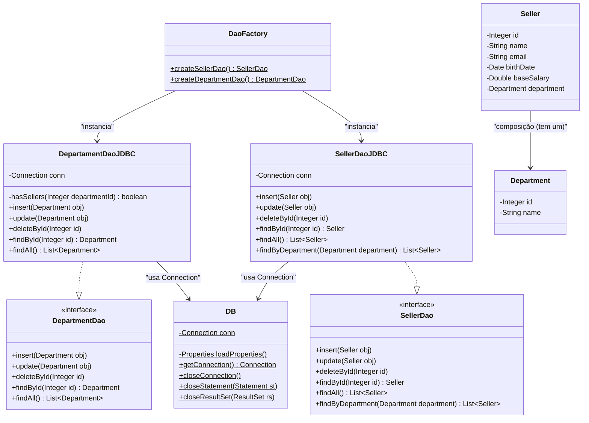
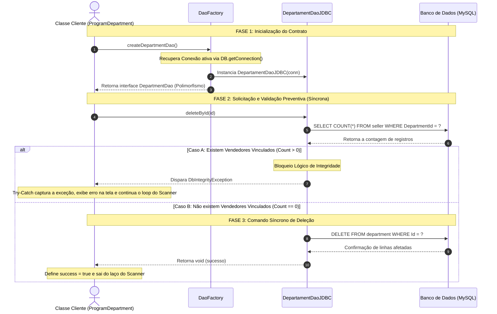

# 📐 Documentação Arquitetural e Fluxo de Processos

Este documento detalha a estrutura de classes e o fluxo síncrono de execução da camada de persistência implementada neste projeto.

---

## 🗺️ Diagrama de Classes (UML)

O diagrama abaixo ilustra o desacoplamento obtido através do padrão DAO. A classe cliente (`ProgramDepartment` ou `Program`) interage apenas com as interfaces e com a fábrica (`DaoFactory`), sem expor os detalhes de conexão JDBC ou sintaxe SQL do banco MySQL.

---

## 🔄 Fluxo de Processo Linear e Síncrono

Abaixo está o fluxo detalhado de quando o programa tenta realizar a deleção de um departamento. Este processo ilustra a **validação preventiva de integridade referencial (Opção B)** escolhida para proteger a consistência relacional.

---

## 📝 Fases Detalhadas do Processo

1.  **Fase de Inicialização:** A classe `Program` solicita um DAO abstrato para a `DaoFactory`. A fábrica cria a conexão com o banco e injeta essa conexão na instância concreta da implementação JDBC, mantendo a classe cliente desacoplada da infraestrutura.
2.  **Fase de Validação Preventiva:** Ao chamar `deleteById(id)`, a classe de implementação executa primeiro um `SELECT COUNT(*)` na tabela de vendedores. Essa verificação é síncrona e impede comandos de remoção inconsistentes antes mesmo que o banco de dados precise rejeitar a operação.
3.  **Fase de Tomada de Decisão:**
    *   **Violação de Integridade:** Se o contador retornar maior que zero, o fluxo de exclusão é abortado e relança uma `DbIntegrityException`. A classe de aplicação captura esse erro no bloco `try-catch`, mantendo o laço de repetição aberto para o usuário tentar outro ID.
    *   **Exclusão Autorizada:** Se o contador for igual a zero, a query de exclusão física (`DELETE`) é enviada ao banco de dados e executada com sucesso.
